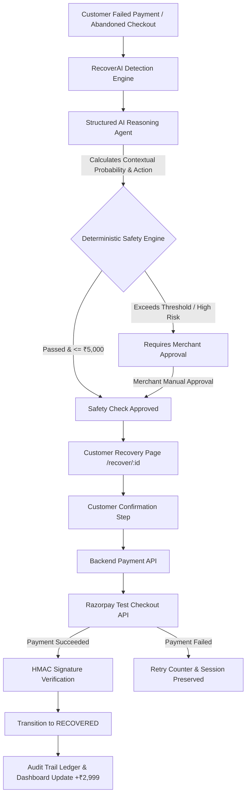

# RecoverAI

🚀 **Live Demo:** recover-ai-pi-ten.vercel.app or https://recover-ai-pi-ten.vercel.app
   
   
# 🛡️ RecoverAI — Controlled AI Revenue Recovery Agent

> **Pitch**: RecoverAI is a controlled AI revenue-recovery agent that identifies money at risk, determines the most effective recovery action, and safely converts failed or abandoned payment attempts into recovered revenue—with deterministic safety controls and a complete audit trail.

---

## 🚀 Key Highlights & Architecture Principles

- **💰 Prominent Revenue Metrics**: Main merchant dashboard highlights **💰 Revenue Recovered** (`₹31,200 recovered by RecoverAI`).
- **🤖 Contextual AI Reasoning Layer**: AI processes customer purchase history, cart value, failure code, time since failure, and merchant rules to calculate recovery probability and recommend structured recovery actions.
- **🛡️ Strict Safety Control Rule**: **AI CANNOT directly authorize or execute payments**. All AI recommendations must pass the server-side Deterministic Safety Engine and receive Customer/Merchant confirmation before backend initiates Razorpay checkout.
- **💳 Real Razorpay Test Mode Integration**: Real REST order creation (`/v1/orders`) and HMAC-SHA256 signature verification with standard checkout JS loader and fallback simulator.
- **📊 Performance Benchmark**: Measured recovery results comparing Baseline Recovery (4 / 10) vs RecoverAI (7 / 10) (+75% relative lift), labeled as *Demo Benchmark — simulated dataset*.
- **📜 Immutable AI Audit Trail**: Detailed event ledger capturing every state change, AI recommendation, safety check, and payment confirmation.
- **🎬 Interactive Demo Bar**: Built-in interactive floating bar to trigger failed payments, run AI analysis, simulate payment success, simulate payment retries, and reset demo data.

---

## 📐 End-to-End Architecture Flow



> ⚠️ **Hard Security Constraint**: `AI Recommendation` → `Safety Engine` → `Customer/Merchant Confirmation` → `Backend API` → `Razorpay`. The AI Agent never connects directly to Razorpay API or money movement tools.

---

## 🛠️ Technology Stack

- **Backend**: Python 3.10+ / FastAPI, SQLAlchemy (SQLite with clean repository abstraction), Pydantic v2, `python-razorpay`, `httpx`.
- **Frontend**: React 18, TypeScript, Vite, Tailwind CSS, Lucide Icons, Recharts, React Router v6.
- **Payment Gateway**: Razorpay Test Mode API (`/v1/orders`, HMAC-SHA256 signature verification).

---

## 🚀 Quick Setup & How to Run

### 1. Environment Variables Configuration

Copy `.env.example` to `.env` inside `backend/`:

```bash
cd backend
cp .env.example .env
```

Environment contents:
```ini
RAZORPAY_KEY_ID=rzp_test_recoverai_demo
RAZORPAY_KEY_SECRET=demo_secret_key_12345
AI_API_KEY=
DATABASE_URL=sqlite:///./recover_ai.db
ENVIRONMENT=development
```

### 2. Run Backend Server (FastAPI)

```bash
cd backend
.venv\Scripts\python.exe -m uvicorn app.main:app --host 127.0.0.1 --port 8000
```

Backend will run at: `http://127.0.0.1:8000`  
Swagger API Docs: `http://127.0.0.1:8000/docs`

### 3. Run Frontend (React + Vite)

```bash
cd frontend
npm run dev
```

Frontend dashboard will open at: `http://127.0.0.1:5173`

---

## 🎬 Demo Walkthrough Guide

1. **Merchant Dashboard**: Open `http://127.0.0.1:5173`. Observe **₹52,400 Revenue at Risk** and **₹31,200 Recovered by RecoverAI**.
2. **Opportunities Table**: Inspect opportunity `TXN_1024` (Rahul Sharma, Running Shoes Pro 2.0, ₹2,999, `PAYMENT_FAILED`).
3. **Trigger AI Analysis**: Click **Analyze with RecoverAI**.
   - AI evaluates customer history (4 orders) + 3DS timeout failure.
   - AI returns contextually calculated recovery score, `PAYMENT_RETRY` recommendation, and explanation.
4. **Safety Engine Evaluation**:
   - Safety rule checks: ₹2,999 <= ₹5,000 threshold, Attempt 1 <= 2.
   - Status automatically transitions to `RECOVERY_APPROVED`.
5. **Customer Link**: Click **Open Customer Checkout Link** or navigate to `/recover/TXN_1024`.
6. **Customer Confirmation**: Customer sees order details and confirms: `[ Confirm & Pay ]`.
7. **Razorpay Test Checkout**: Click **Simulate Successful Payment**.
8. **Signature Verification & Status Update**:
   - Backend verifies HMAC signature.
   - Transaction transitions to `RECOVERED`.
   - Dashboard KPI updates: Recovered Revenue increases by +₹2,999.
9. **Audit Trail**: Navigate to **Audit Trail**. See complete chronological event logs (`PAYMENT_FAILED` → `AI_ANALYSIS` → `SAFETY_CHECK` → `RAZORPAY_ORDER_CREATED` → `PAYMENT_SUCCESS` → `REVENUE_RECOVERED`).
10. **Payment Failure Scenario**:
    - Click **[Simulate Failed Payment]** on floating demo bar.
    - Test retrying payment with **Simulate Failed Payment Retry**.
    - Backend handles failure, increments attempt counter, preserves recovery session, prevents duplicate orders, and shows message:
      > *"Payment could not be completed. You have not been charged. Your recovery session has been saved and you can try again."*
